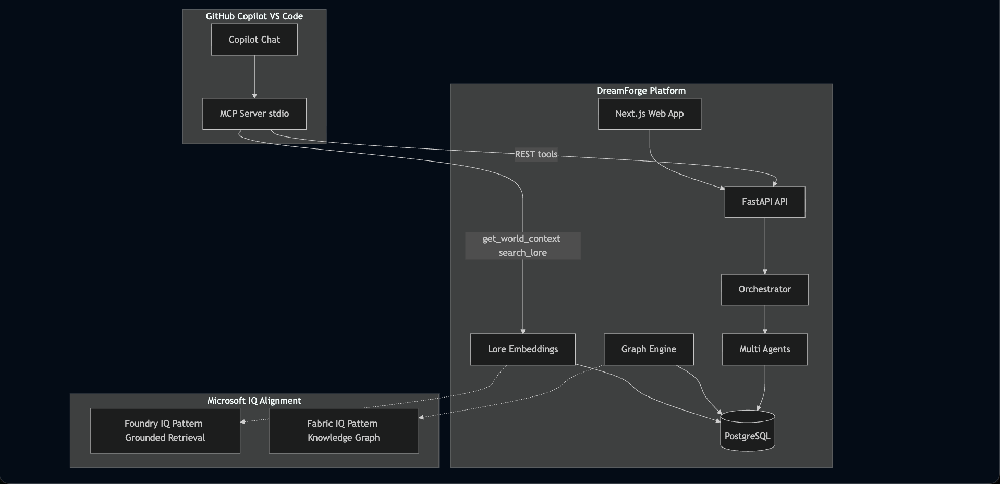

# DreamForge

**AI Universe Creation Platform** — Create rich, interconnected fictional worlds with AI-assisted workflows.

> Notion for storytelling + Figma for worldbuilding + GitHub Copilot for creativity.

## Table of Contents

| | |
|---|---|
| **[Demo Video](#demo-video)** | 5-minute walkthrough (YouTube) |
| **[Architecture Diagram](#architecture-diagram)** | How Copilot, MCP, and the platform connect |
| **[Sequence Diagram](#sequence-diagram-copilot-quest-flow)** | End-to-end quest generation flow |
| [Features](#features) | Core capabilities |
| [Tech Stack](#tech-stack) | Technologies used |
| [Quick Start](#quick-start) | Run locally or with Docker |
| [Demo Data](#demo-data) | Seeded universes and entities |
| [Environment](#environment) | Configuration variables |
| [API](#api) | Key REST endpoints |
| [License](#license) | MIT |

---

## Demo Video

**Hackathon judges — start here** for a full product walkthrough.

[](https://youtu.be/WSNM_yASWiE)

[](https://youtu.be/WSNM_yASWiE)

**Direct link:** [https://youtu.be/WSNM_yASWiE](https://youtu.be/WSNM_yASWiE)

---

## Architecture Diagram

How **GitHub Copilot**, the **MCP server**, the **DreamForge platform**, and **Microsoft IQ alignment patterns** fit together:



---

## Sequence Diagram (Copilot Quest Flow)

What happens when a user asks Copilot to create a lore-consistent quest — from chat through MCP, FastAPI, agents, and back to the web app:


---

## Features

- **Universe Generation Engine** — History, geography, factions, magic systems from a single prompt
- **Knowledge Graph** — Interactive visualization of all entities and relationships
- **Time Machine** — Drag the timeline to see universe state at any era
- **AI World Council** — Multi-agent debate with visible reasoning
- **Lore Consistency Agent** — Timeline and contradiction validation
- **MCP Server** — GitHub Copilot integration for quest/character/dialogue generation
- **Evaluation Layer** — Consistency, creativity, completeness, and wow factor scores

## Tech Stack

| Layer | Technology |
|-------|------------|
| Frontend | Next.js 15, TypeScript, Tailwind, shadcn/ui, Framer Motion, React Flow |
| Backend | FastAPI, PostgreSQL, pgvector, SQLAlchemy, Alembic |
| AI | OpenAI SDK, GitHub Models, multi-agent orchestration |
| MCP | TypeScript stdio server for GitHub Copilot |

## Quick Start

### Prerequisites

- PostgreSQL 14+ (Homebrew or Docker)
- Node.js 20+
- Python 3.11+

### Run Locally (recommended)

```bash
cp .env.example .env

# Create database (one-time)
createdb dreamforge

# Backend
cd backend
python3 -m pip install -e .
python3 -m uvicorn app.main:app --reload --port 8000

# Frontend (new terminal)
cd frontend
npm install
npm run dev

# Optional: seed demo data manually
cd backend && python3 -m app.demo.seed
```

- Frontend: http://localhost:3000
- Backend API: http://localhost:8000
- API Docs: http://localhost:8000/docs

### Run with Docker

```bash
cp .env.example .env
# Start Docker Desktop, then:
docker compose up --build
```

### MCP Server (Copilot)

```bash
cd mcp-server && npm install
npm run mcp
```

Configured in `.vscode/mcp.json` for VS Code Copilot integration.

## Demo Data

On first boot in demo mode, DreamForge seeds:

- 5 universes (dark fantasy, sci-fi, cyberpunk, mythic horror, solarpunk)
- 50 characters, 20 factions, 100 events
- Full knowledge graph with relationships

## Environment

See `.env.example` for all configuration options.

| Variable | Description |
|----------|-------------|
| `DREAMFORGE_MODE` | `demo` or `live` — controls AI (canned vs GitHub Models) |
| `DREAMFORGE_AUTH_MODE` | `demo` or `azure` — controls API auth (use `demo` for local + MCP) |
| `DATABASE_URL` | PostgreSQL connection string |
| `GITHUB_TOKEN` | GitHub Models API key (recommended for live AI) |
| `OPENAI_API_KEY` | Alternative OpenAI-compatible API key |
| `NEXT_PUBLIC_DREAMFORGE_AUTH_MODE` | Frontend auth UI: `demo` skips Azure login |
| `NEXT_PUBLIC_AZURE_CLIENT_ID` | Azure Entra auth (only when `DREAMFORGE_AUTH_MODE=azure`) |

## API

Base URL: `http://localhost:8000/api/v1`

Key endpoints:
- `POST /universes/generate` — Create universe (SSE stream)
- `GET /universes/{id}/graph` — Knowledge graph data
- `GET /universes/{id}/timeline/at/{year}` — Time Machine state
- `POST /universes/{id}/council/debate` — World Council (SSE)
- `POST /universes/{id}/search` — Lore search

## License

MIT
